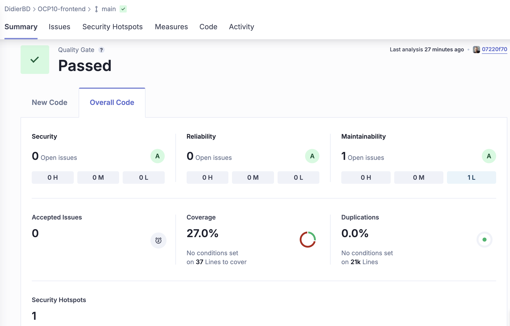

> [!NOTE]
>Ce fichier est une documentation pour la mise en place de pipelines CI/CD avec Docker, des GitActions via GitHub et l'analyse de code via SonarCloud.

# Table des Matières

- [Table des Matières](#table-des-matières)
  - [1 - Introduction](#1---introduction)
    - [Pipeline CI/CD](#pipeline-cicd)
    - [GitHub Actions](#github-actions)
    - [Docker](#docker)
    - [SonarCloud](#sonarcloud)
  - [2 - Installation d'un pipeline CI/CD](#2---installation-dun-pipeline-cicd)
    - [1. Créer un compte Docker Hub](#1-créer-un-compte-docker-hub)
    - [2. Créer un compte SonarCloud](#2-créer-un-compte-sonarcloud)
    - [3. Créer un dossier contenant les github actions](#3-créer-un-dossier-contenant-les-github-actions)
  - [3 - Configuration du pipeline](#3---configuration-du-pipeline)
    - [1. Configuration de sonarcloud](#1-configuration-de-sonarcloud)
      - [Creation de 2 fichiers github actions](#creation-de-2-fichiers-github-actions)
      - [Creation de 2 fichiers `sonar-project.properties` de configuration](#creation-de-2-fichiers-sonar-projectproperties-de-configuration)
      - [Ajout des secrets dans GitHub](#ajout-des-secrets-dans-github)
    - [2. Configuration de Docker](#2-configuration-de-docker)
      - [Création de 2 fichiers github actions.](#création-de-2-fichiers-github-actions)
      - [Création de 2 fichiers `Dockerfile` de configuration.](#création-de-2-fichiers-dockerfile-de-configuration)
    - [3. Configuration des GitHub Actions](#3-configuration-des-github-actions)
    - [4. Configuration de Karma et JaCoCo pour les tests \& couverture de code](#4-configuration-de-karma-et-jacoco-pour-les-tests--couverture-de-code)
      - [Configuration de Karma](#configuration-de-karma)
      - [Configuration de JaCoCo](#configuration-de-jacoco)
  - [4 - Etapes des GitActions pour le backend](#4---etapes-des-gitactions-pour-le-backend)
    - [CI-sonarCloud-backend.yml](#ci-sonarcloud-backendyml)
    - [CD-dockerHub-deploy-backend.yml](#cd-dockerhub-deploy-backendyml)
  - [5 - Etapes des GitActions pour le frontend](#5---etapes-des-gitactions-pour-le-frontend)
    - [CI-sonarCloud-frontend.yml](#ci-sonarcloud-frontendyml)
    - [CD-dockerHub-deploy-frontend.yml](#cd-dockerhub-deploy-frontendyml)
  - [6 - Ajout des KPIs (via SonarCloud et des Quality Gates)](#6---ajout-des-kpis-via-sonarcloud-et-des-quality-gates)
    - [KPI num 1: Coverage](#kpi-num-1-coverage)
    - [KPI num 2: Security hotspots Reviewed](#kpi-num-2-security-hotspots-reviewed)
  - [7 - Analyse des metriques et retours utilisateurs](#7---analyse-des-metriques-et-retours-utilisateurs)
    - [1. Metriques](#1-metriques)
      - [Couverture de code frontend](#couverture-de-code-frontend)
      - [Couverture de code backend](#couverture-de-code-backend)
      - [Retours utilisateurs](#retours-utilisateurs)

## 1 - Introduction
### Pipeline CI/CD
Continuous Integration/Continuous Deployment (Intégration Continue/Déploiement Continue) est un ensemble de pratiques automatisées qui permettent de tester et de déployer automatiquement les modifications apportées à un projet. Ces pratiques permettent de garantir la qualité du code et de faciliter le déploiement des applications.
### GitHub Actions
GitHub Actions est un service d'intégration et de déploiement continu (CI/CD) qui permet d'automatiser les tâches de développement telles que la création, les tests et le déploiement de code directement depuis GitHub. Les actions sont des scripts qui s'exécutent automatiquement en réponse à des événements spécifiques sur un dépôt GitHub (comme la création d'une pull request, le push de code, la création d'une release, etc.).
### Docker
Docker est une plateforme open-source qui permet de créer, de déployer et de gérer des applications dans des conteneurs. Les conteneurs sont des environnements isolés qui contiennent tout ce dont une application a besoin pour s'exécuter (code, dépendances, bibliothèques, etc.). Docker permet de créer des conteneurs légers et portables qui peuvent s'exécuter sur n'importe quel système d'exploitation.
### SonarCloud
SonarCloud est un service d'analyse de code en ligne qui permet de détecter les problèmes de qualité du code et de les corriger avant qu'ils ne deviennent des problèmes plus graves. SonarCloud analyse le code source d'un projet et identifie les erreurs, les bugs, les vulnérabilités, les duplications de code, les mauvaises pratiques, etc. SonarCloud fournit des rapports détaillés sur la qualité du code et des recommandations pour l'améliorer.

## 2 - Installation d'un pipeline CI/CD
Pour mettre en place un pipeline CI/CD avec Docker, GitActions et SonarCloud, suivez les étapes suivantes :
### 1. Créer un compte Docker Hub
Pour créer un compte Docker Hub, rendez-vous sur le site [Docker Hub](https://hub.docker.com/) et cliquez sur le bouton "Sign Up" pour créer un compte.
### 2. Créer un compte SonarCloud
Pour créer un compte SonarCloud, rendez-vous sur le site [SonarCloud](https://sonarcloud.io/) et cliquez sur le bouton "Log In" pour créer un compte.
### 3. Créer un dossier contenant les github actions
Créez un dossier `.github/workflows` à la racine de votre projet et ajoutez y les fichiers `****.yml` contenant les actions à exécuter lors des événements spécifiques sur votre dépôt GitHub.

## 3 - Configuration du pipeline
### 1. Configuration de sonarcloud
#### Creation de 2 fichiers github actions
Dans le dossier `.github/workflows`, un pour le frontend et un pour le backend:

`CI-sonarCloud-frontend.yml` pour le frontend:

*Voir les commentaires dans le fichierpour plus de detail*

`CI-sonarCloud-backend.yml` pour le backend

*Voir les commentaires dans le fichier pour plus de détails.*

Ces 2 fichiers contiennent les actions à exécuter lors des événements spécifiques sur votre dépôt GitHub.

#### Creation de 2 fichiers `sonar-project.properties` de configuration
Création de 2 fichiers `sonar-project.properties` à la racine de votre projet frontend et backend. Ces fichiers contiennent les configurations pour SonarCloud, voir les commentaires dans les fichiers pour plus de détails.

#### Ajout des secrets dans GitHub
Pour que les actions puissent accéder à SonarCloud, on doit ajouter les secrets:

Accéder aux paramètres de votre repository GitHub :  
Dans le menu de gauche, cliquez sur "Secrets and variables" puis sur "Actions".  
Cliquez sur "New repository secret" (Nouveau secret de repository).  
Ajoutez les secrets suivants :  
**DOCKER_USERNAME** : Votre nom d'utilisateur Docker Hub.  
**DOCKER_PASSWORD** : Votre mot de passe Docker Hub.  
**SONAR_TOKEN_FRONTEND** : Votre jeton d'accès SonarCloud pour le frontend (généré dans SonarCloud sous "My Account" > "Security").  
**SONAR_TOKEN_BACKEND** : Votre jeton d'accès SonarCloud pour le backend (généré dans SonarCloud sous "My Account" > "Security").  
**SONAR_HOST_URL** : L'URL de votre instance SonarCloud (par exemple, https://sonarcloud.io).

### 2. Configuration de Docker
#### Création de 2 fichiers github actions. 
A la racine du projet frontend et backend.  
`CD-dockerHub-deploy-backend.yml` pour le backend.  
`CD-dockerHub-deploy-frontend.yml` pour le frontend.  

Ces fichiers contiennent les configurations pour les services Docker de l'application. Voir les commentaires dans les fichiers pour plus de détails.
#### Création de 2 fichiers `Dockerfile` de configuration. 
A la racine du dossier frontend et du dossier backend. Ces fichiers contiennent les instructions pour construire l'image Docker de l'application. Voir les commentaires dans les fichiers pour plus de détails.

### 3. Configuration des GitHub Actions
Création de 4 fichiers `****.yml` à la racine du dossier `.github/workflows`. 2 fichiers pour les actions CI (Continuous integration) et 2 fichiers CD (Continuous Deployment).  
Voir les commentaires dans les fichiers pour plus de détails.

### 4. Configuration de Karma et JaCoCo pour les tests & couverture de code
Pour le frontend, on utilise Karma pour les tests et JaCoCo pour la couverture de code.  
#### Configuration de Karma
Le fichier `karma.conf.js` fourni dans le projet, contient la configuration de Karma. Modification pour les tests en mode headless et la génération des rapports de couverture de code (voir les commentaires dans le fichier pour plus de détails).  
Notament, la configuration de `browsers` à `ChromeHeadless` pour les tests en mode headless et `lcov` pour la génération des rapports de couverture de code pour SonarCloud.  
Modification de `package.json` pour ajouter les scripts de test en mode ChromeHeadLess, notamment le script `test:prod` 
Ajout de la version de SonarScanner dans `package.json` pour l'analyse de code: `sonar-scanner@4.6.2`
#### Configuration de JaCoCo
Le fichier `pom.xml` fourni dans le projet, contient la configuration de JaCoCo. Modification pour la génération des rapports de couverture de code (voir les commentaires dans le fichier pour plus de détails).
## 4 - Etapes des GitActions pour le backend
### CI-sonarCloud-backend.yml
1. Checkout du code source
2. Configuration de JDK 17
3. Mise en cache des packages SonarCloud
4. Mise en cache des packages Maven
5. Build et analyse avec SonarCloud du code
6. Téléchargement du rapport de couverture JaCoCo en tant qu'artifact

*Il se déclenche sur les pushs vers la branche main et les pull requests. Les étapes incluent le checkout du code, la configuration de JDK 17, la mise en cache des packages SonarCloud et Maven, et l'analyse du code. Il télécharge le rapport de couverture JaCoCo en tant qu'artifact. Voir les commentaires dans le fichier pour plus de détails.*
### CD-dockerHub-deploy-backend.yml
1. Checkout du code source
2. Configuration de JDK 11
3. Build de l'image Docker avec Maven
4. Connexion à Docker Hub
5. Construction et push de l'image Docker

*Ce workflow GitHub Actions déploie le backend sur Docker Hub. Il se déclenche sur les pushs vers la branche main. Les étapes incluent le checkout du code, la configuration de JDK 11, la construction du projet avec Maven, la connexion à Docker Hub, et la construction et le push de l'image Docker.*
## 5 - Etapes des GitActions pour le frontend
### CI-sonarCloud-frontend.yml
1. Checkout du code source
2. Configuration de Node.js
3. Configuration de JDK 17
4. Cache des modules Node.js
5. Installation des dépendances
6. Installation de Xvfb
7. Démarrage de Xvfb
8. Exécution des tests
9. Analyse SonarQube pour le frontend
10. Lister les fichiers de couverture
11. Upload des résultats de test frontend

*Il se déclenche sur les pushs vers la branche main et les pull requests. Les étapes incluent l'exécution des tests en mode headless, l'analyse SonarQube, la liste des fichiers de couverture et l'upload des résultats de test. Voir les commentaires dans le fichier pour plus de détails.*
### CD-dockerHub-deploy-frontend.yml
1. Checkout du code source
2. Configuration de Node.js
3. Configuration de JDK 17
4. Construction du projet
5. Connexion à Docker Hub
6. Construction et push de l'image Docker

*Ce workflow GitHub Actions déploie le frontend sur Docker Hub. Il se déclenche sur les pushs vers la branche main. Les étapes incluent le checkout du code, la configuration de Node.js, l'installation des dépendances, la construction du projet, la connexion à Docker Hub, et la construction et le push de l'image Docker.*
## 6 - Ajout des KPIs (via SonarCloud et des Quality Gates)
Ajout de KPIs (Key Performance Indicators) au projet via des Quality Gates.
### KPI num 1: Coverage
Le KPI num 1 est la couverture de code. Il est mesuré par JaCoCo et affiché dans SonarCloud. Le Quality Gate pour ce KPI est de 80%. Ca signifie que le code doit avoir une couverture de code de 80% ou plus pour passer le Quality Gate.
### KPI num 2: Security hotspots Reviewed
Le KPI num 3 est le nombre de Security Hotspots Reviewed. Un Security Hotspot est un indicateur de risque potentiel dans le code qui nécessite une attention particulière pour garantir qu'il ne devienne pas une vulnérabilité de sécurité.
Il est mesuré par SonarCloud et affiché dans le tableau de bord. Le Quality Gate pour ce KPI est de moins de 100%. Ca signifie qu'il ne doit pas y avoir de Security Hotspots Reviewed dans le code pour passer le Quality Gate.

## 7 - Analyse des metriques et retours utilisateurs
### 1. Metriques
#### Couverture de code frontend

Le coverage est ici de 27% ce qui est très faible. Il faudrait augmenter la couverture de code pour passer le Quality Gate. Il y a aussi 1 security hotspot reviewed qui doit être corrigé pour passer le Quality Gate.

#### Couverture de code backend

Le coverage est de 38,8% ce qui est également faible. Il faudrait augmenter la couverture de code pour passer le Quality Gate. Il y a aussi 2 security hotspots reviewed qui doivent être corrigés pour passer le Quality Gate.

#### Retours utilisateurs
1. "Je mets une étoile car je ne peux pas en mettre zéro ! Impossible de poster une suggestion de blague, le bouton tourne et fait planter mon navigateur"
2. "#BobApp j'ai remonté un bug sur le post de vidéo il y a deux semaines et il est encore présent ! Les devs vous faites quoi????"

Ces 2 retours sont symptomatiques d'un probleme de performance et de stabilité de l'application. La mise en place d'un pipeline CI/CD avec des tests et des analyses de code permet de détecter et de corriger ces problèmes avant que le code ne soit mis en production.

3. "Ca fait une semaine que je ne reçois plus rien, j'ai envoyé un email il y a 5 jours mais toujours pas de nouvelles..."

4. "J'ai supprimé ce site de mes favoris ce matin, dommage, vraiment dommage."

Ces 2 retours utilisateur sont symptomatiques d'un probleme de communication entre les équipes de développement et les utilisateurs. La mise en place d'un pipeline CI/CD avec des KPIs permet de suivre la qualité du code et de communiquer efficacement avec les utilisateurs.

> [!NOTE]
>Pour mettre en place une strategie CI/CD efficace, il est important de suivre les KPIs, d'analyser les retours utilisateurs et de corriger les problemes rapidement. Il serait judicieux de modifier les gitHub actions de CD pour que le deploiement ne se fasse que si les Quality Gates sont passés.
